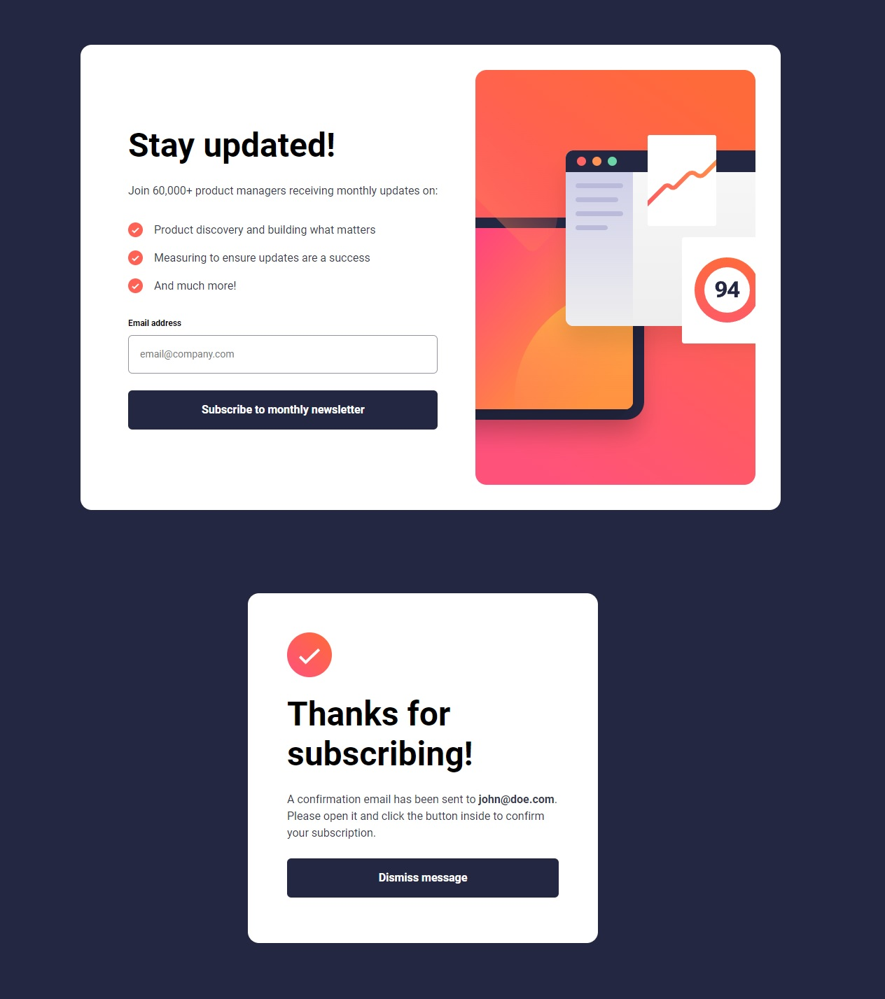

# Frontend Mentor - Newsletter sign-up form with success message solution

This is a solution to the [Newsletter sign-up form with success message challenge on Frontend Mentor](https://www.frontendmentor.io/challenges/newsletter-signup-form-with-success-message-3FC1AZbNrv). Frontend Mentor challenges help you improve your coding skills by building realistic projects.

## Table of contents

- [Overview](#overview)
  - [Screenshot](#screenshot)
  - [Links](#links)
  - [Built with](#built-with)
- [Author](#author)

## Overview

Responsive newsletter sign-up form with success message, utilizing two different states managed by JS. Additional form validation added with error messages rendered in DOM.

### Screenshot

### Links

- Solution URL: [Frontend Mentor](https://www.frontendmentor.io/solutions/newsletter-sign-up-using-sassscss-flexbox-and-grid-E09hOa8yjR)
- Live Site URL: [GitHub Page](https://nastaj.github.io/newsletter-sign-up/)

### Built with

- Semantic HTML5 markup
- SCSS
- CSS custom properties
- Flexbox
- Grid
- JavaScript
